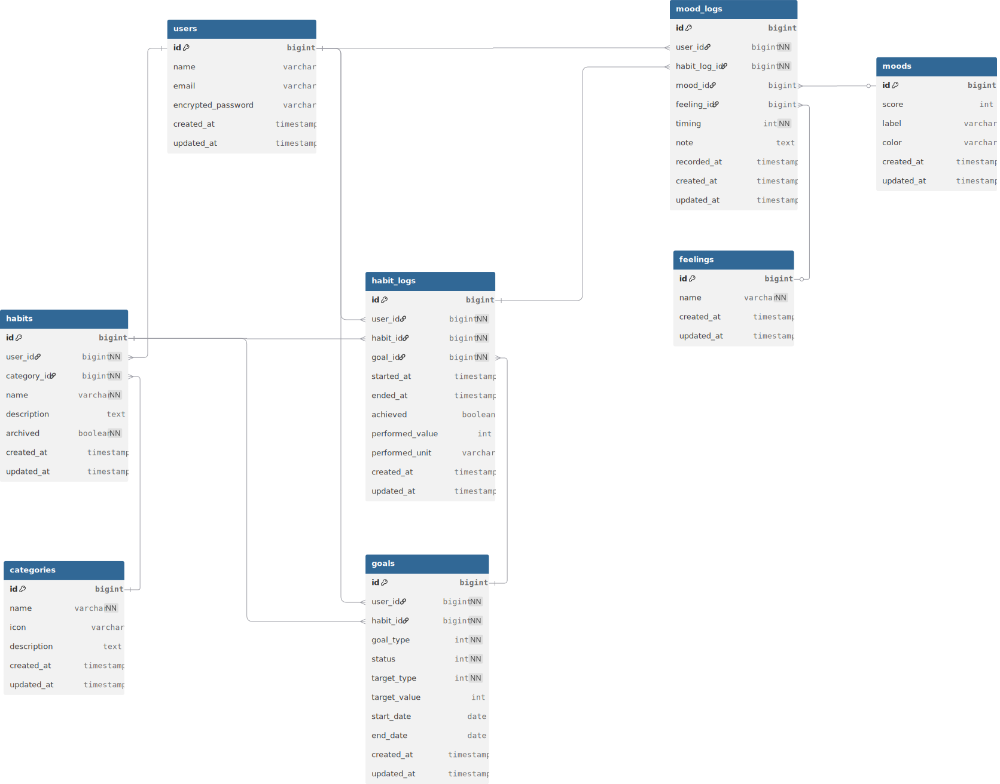

# kokolog（こころぐ）

## サービス概要

**kokolog は、行動と気分の相関に気づき、より良い一日を過ごすための内省支援アプリです。**

人は日々さまざまな行動をしていますが、  
「その行動が自分の調子にどう影響しているのか」まで意識できている人は多くありません。

kokolog では、行動と気分をゆるやかに記録し、  
振り返ることで **自分の調子を整えるヒントに気づける状態** を目指しています。

行動を管理したり、達成を競うアプリではありません。  
**自分のコンディションを理解するためのアプリ** です。

---

## 解決したい課題

- 調子の良し悪しの理由が分からない
- うまくいかない日が続くと、自分を責めてしまう
- 調子が良かった日も、理由を振り返らずに終わってしまう
- 安定してパフォーマンスを出したいが、方法が見えない

kokolog は  
**行動と気分の関係を可視化し、客観的に気づける状態を作ること** で、  
これらの課題を解決しようとしています。

---

## このサービスを作った背景

私自身、生活習慣や行動を改善しようとする中で、

- 行動できる日と、できない日がある
- 調子の良い日は、自然と良い行動ができている
- 調子の悪い日は、後から強い後悔だけが残る

という経験を繰り返してきました。

行動を続けられた理由は、  
「頑張れたから」ではなく、  
**行動のあとに気分が良くなる体験を実感できたから** でした。

一方で、調子が悪い日には  
「自分がダメだからだ」と考えてしまいがちでした。

kokolog は、  
こうした体験から生まれた

- 行動を押し付けない
- できなかった日も否定しない
- まずは“気づく”ことを大切にする

という思想をもとに作られています。

---

## kokolog が提供したい体験

- **調子が良くなる行動に気づく**  
  → 無理なく、その行動を続けられるようになる

- **調子が悪い日を客観的に捉える**  
  → 自分を責めず、環境や行動を変える選択ができる

- **振り返りを通して、自分の周期を知る**  
  → 調子の波を前提に、一日を設計できるようになる

「常に頑張る」のではなく、  
**自分の調子と付き合いながら、より良い一日を増やしていく**  
そんな体験を目指しています。

---

## 想定ユーザー

- より良い一日を過ごしたい人
- 安定してパフォーマンスを出したい人
- 自分の調子やリズムを理解したい人
- 習慣化が苦手だが、自分を責めたくない人

年齢や職業ではなく、  
**自分のコンディションを理解したいという意識** を持つ人を対象としています。

---

## 主な機能

- 気分の記録
- 行動の記録
- 気分と行動の関連記録
- 日ごとの振り返り
- 気分グラフ
- カレンダーによる振り返り表示

---

## 技術スタック

- **Backend**: Ruby on Rails 7.2.2  
- **Frontend**: Tailwind CSS v4 / daisyUI / Hotwire（Turbo / Stimulus）  
- **Database**: PostgreSQL  
- **Infra**: Render / Neon  
- **Auth**: Devise / Google認証  
- **Development**: Docker  

---

### 画面遷移図
Figma：https://www.figma.com/design/QTo6iqzroFB655HoUNJTrc/kokolog?node-id=0-1&t=SEncSvWt1HWWR0MB-1

---

### ER図

[▶︎ dbdiagramで開く](https://dbdiagram.io/d/kokolog-684047aa76955641c29f01ca)
---

## 🌟 キャッチコピー
**こころぐ – 行動でこころを健康に。気分を記録し、変化を見える化。**
